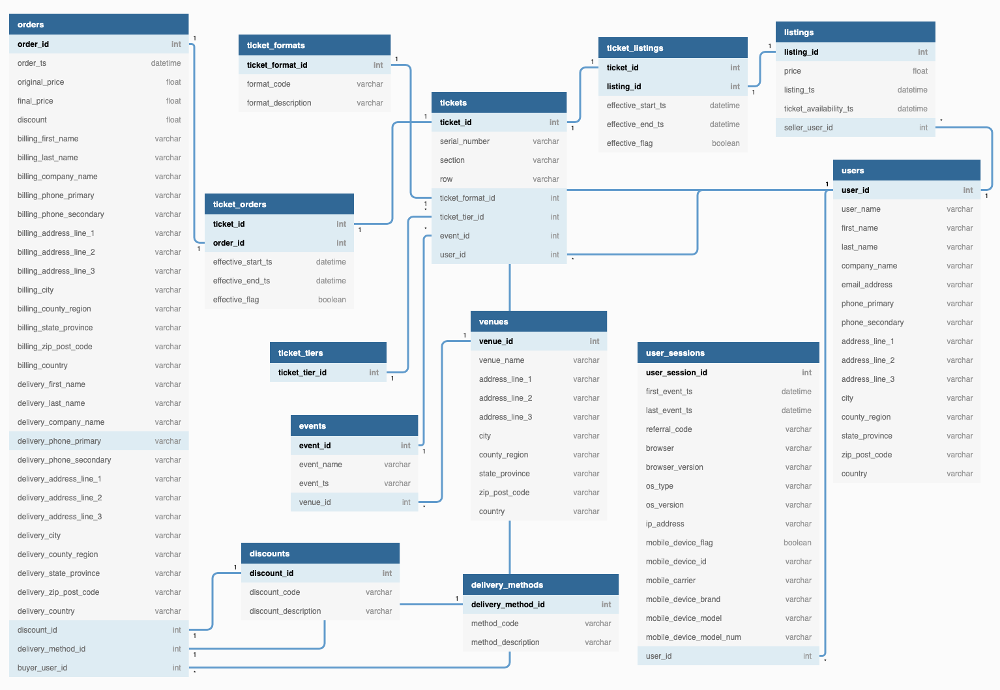
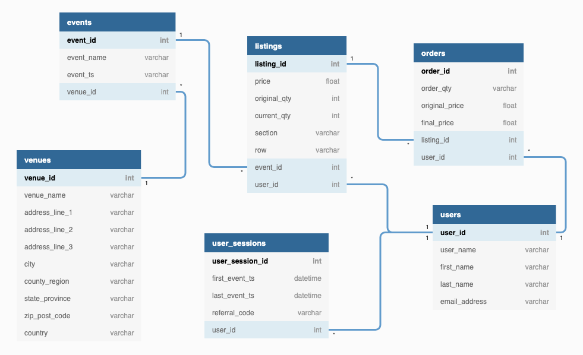

# ticketing

## The Challenge

### Step 1
Please read the following business scenarios and generate a relational data model. Think about which attributes are important to capture. Below is a sample subset of attributes:
- Ticket Price
- Customer Address
- User referral (direct, Google, ESPN)
- Event Location

#### Scenario 1
A seller lists tickets for sale for multiple events

#### Scenario 2
A customer is referred to your application from another site in order to see a list of all available tickets for an event

#### Scenario 3
A customer directly goes to your site to see a list of tickets in a specific city within a specified date range

#### Scenario 4
A customer buys a ticket

### Step 2
Utilize the data model above to generate and apply a schema for a database of your choosing. 

Attached is a csv with available tickets for a specific event. Use this file to seed your database with relevant information. This file is not fully encompassing of all required data. You may provide additional fictitious data to fit your data model.

### Step 3
Develop a simple API endpoint that communicates with your database. The following endpoints should be available:
- Get available tickets for an event    DONE
- Post a new ticket from a seller       DONE
- Update (Put) a ticket to sold         DONE
- Get “The Best” ticket from an event   DONE
    - Define “best” as you see fit. This could include, closest seat, lowest price, or best overall value. 
    - At a minimum, return a json string of the ticket, section, row, and price.
- Authentication, security, etc are not required

#### Technical Requirements:
- Use GitHub as source control and submit your repo
- Provide instructions for running and building the db and application from scratch. We should be able to replicate on a clean installation of OSX/Linux.

#### Hints:
- Keep the application simple. We are not looking for web application developers
- Make the application portable. We use docker quite extensively
- There are no time limits, but this was intended to be completed within 1-2 hours

#### The Data:
- Original Seed Dataset: [web/data/sampleTickets.csv](web/data/sampleTickets.csv)

## The Data Model
Originally, I aimed to fully normalize the structure with join tables to facilitate many-to-many joins between tickets and listings and tickets and orders, respectively.  However, that added a decent amount of development overhead to handle cases where buyers only wanted to purchase a subset of tickets in a listing.  By denormalizing this relationship, we simplify the way in which we keep track of the current quantity of tickets available in a listing - namely, by modifying a "current quantity" field in the listing.  The result of this, however, is that we lose the ability to show buyers the individiual seats available - a worthwhile feature, but maybe not necessary for this demonstration.

See both the original, normalized and current, denormalized E-R diagrams below.

### The Original Model
[dbdiagram.io pseudo schema](docs/ERDiagramOriginal.dbdiagram.txt)


### The Current Model
[dbdiagram.io pseudo schema](docs/ERDiagramCurrent.dbdiagram.txt)


## Environment Variables
The app is setup to handle 3 environments: Prod, Dev, and Local. Running locally, which is covered in the next section, will provide the best experience for quickly iterating in development.  Running in Dev and Prod will translate to running in Docker containers (facilitated by Docker Compose).

Each environment expects a "dotenv" file to be present in the project root (same level as ```docker-compose.yml``` file) for providing environment variables:
- Prod: ```.env-prod```
- Dev: ```.env-dev```
- Local: ```.env-local```

As of this writing, each file expects the following structure, where the order of the ```key=value``` pairs is irrelevant:
```
ENV=<environment-name>                  # Must use 'dev', 'prod', or 'local'
POSTGRES_USER=<postgresql-username>     # i.e., postgres
POSTGRES_PASSWORD=<postgresql-password> # i.e., mysupersecretpassword
POSTGRES_DB=<postgresql-db-name>        # i.e., postgres
POSTGRES_HOST=<postgresql-hostname>     # Must use 'localhost' for local env or 'db' for Docker envs
POSTGRES_PORT=<postgresql-port>         # Canonical port number is 5432
```

Below is an example of a ```.env-local``` file for local environment development:
```
ENV=local
POSTGRES_USER=postgres
POSTGRES_PASSWORD=password
POSTGRES_DB=postgres
POSTGRES_HOST=localhost
POSTGRES_PORT=5432
```

Below is an example of a ```.env-dev``` file for dev environment running in Docker:
```
ENV=dev
POSTGRES_USER=postgres
POSTGRES_PASSWORD=password
POSTGRES_DB=postgres
POSTGRES_HOST=db
POSTGRES_PORT=5432
```

## Run Locally

### PostgreSQL and Psycopg2 Pre-Requisites

#### Mac (via Homebrew)
We will use Homebrew to install PostgreSQL, the binaries required for 
pyscopg2 usage, and run the PostgreSQL serivce locally
```
# Uncomment and run the following command if Homebrew is not installed
# /usr/bin/ruby -e "$(curl -fsSL https://raw.githubusercontent.com/Homebrew/install/master/install)"
brew install postgresql
brew tap homebrew/services
brew services start postgresql

# The PostgreSQL username created is your UNIX username, so let's create a 
# default user "postgres" to match the defaults on the Docker container (see
# below). By default no password is assigned. The default DB is also named "postgres".
/usr/local/opt/postgres/bin/createuser -s postgres

# Verify setup
psql -d postgres -U postgres -h localhost
```

#### Linux
```
TBD
```

### Flask Web App
Get started by cloning the GitHub project, setting up the app dependencies,
and starting the web app on port 8000
```
git clone <url>
cd ticketing/web
python3 -m venv venv
source venv/bin/activate
pip install -U pip  # because the warning is annoying
pip install -r requirements.txt

# Veryify setup
export FLASK_APP=app.py
python -m flask run --host=0.0.0.0 --port=8000

# Navigate to http://127.0.0.1:8000/api/v1/ in your browser
# to view the Swagger documentation
```

### Seeding the DB
```
# Create empty tables
cd ticketing/web
python -c 'from modules import db; db.init_db()'
```

## Run via Docker Compose

### Starting

#### Step 1
Stand up the web app and db containers
```
cd ticketing
./docker-compose-up.sh dev
```

#### Step 2
In a separate shell, run a transient web app container to seed the db
```
cd ticketing
./docker-compose-up.sh seed
```

#### Step 3
Verify the app is working at [http://127.0.0.1:8000/api/v1/](http://127.0.0.1:8000/api/v1/). Please note that you can use the Swagger UI to run all commands against the API (i.e., create a new listing, list all tickets, transact a sale, etc.).

#### Step 4
Check out the data on the backend. Note, that if you use the ```.env-dev``` example above, you should be able to run the below commands as-is.
```
psql -d postgres -U postgres -h localhost
Password for user postgres: <TYPE-PASSWORD-PROVIDED-IN-DOTENV-FILE>
psql (11.5)
Type "help" for help.

postgres=# select * from listings limit 1;
 listing_id | price | original_qty | current_qty | section | row | event_id | user_id
------------+-------+--------------+-------------+---------+-----+----------+---------
          1 |    42 |            1 |           1 | 998     | GA  |      162 |       1
(1 row)
```

### Stopping
To stop the containers but not remove the data volume run ```docker-compose stop```

To stop the container and remove the data run ```docker-compose down```


## Next Steps
- Enrich ```ticket``` model with attributes (i.e., wheel chair accessibl, obstructed view, etc.)
- Figure out if ```ticket_tier``` model makes sense to add in
- Create entities to represent event genre, performers, etc.
- Evaluate switching from pip to pipenv
- Add nginx load balancer to stack
- Map container volumes to local locations
- Move /data directory out of web app (and update init_db seeder)
- Add marshmallow package for request param handling (deprecated in flask-restplus)
- Finish adding all appropriate flask-restplus decorators to routes so Swagger docs generate appropriately
